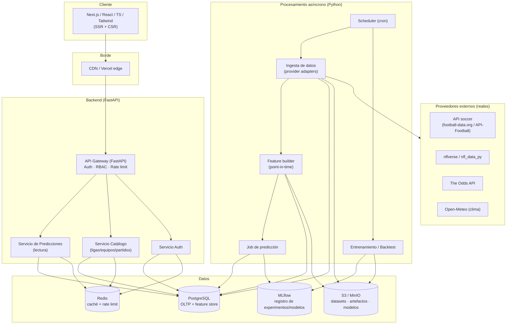

# Documento Técnico del MVP — Plataforma de Predicciones Deportivas

> **Codename del proyecto:** `sports-predictor` (nombre comercial por definir).
> **Versión del documento:** 0.1 — borrador para revisión.
> **Fecha:** 2026-06-23.
> **Deportes objetivo:** Fútbol soccer y Fútbol americano (NFL).
> **Naturaleza:** Plataforma SaaS de analítica probabilística. **No** es una casa de apuestas ni un sistema de apuestas automáticas.

---

## ⚠️ Principios rectores (no negociables)

Estos principios están por encima de cualquier decisión técnica posterior:

1. **Todo es probabilidad, nada es certeza.** Ninguna predicción se presenta como un hecho. Toda salida lleva probabilidad + intervalo/incertidumbre + nivel de confianza con criterio matemático explícito.
2. **Cero fuga temporal (data leakage).** Para predecir el partido `M` con fecha `t`, solo se usan datos con `timestamp < t`. Validación exclusivamente temporal.
3. **Sin datos inventados.** En producción solo datos de proveedores reales y autorizados. En desarrollo, *mock data* etiquetada explícitamente (`is_mock = true`, banner visible en UI).
4. **Reproducibilidad.** Cada predicción queda ligada a `model_version`, `feature_set_version`, `data_snapshot_id` y `seed`. Se puede reconstruir bit a bit.
5. **Transparencia de rendimiento.** Las predicciones fallidas **no se borran ni se ocultan**. El dashboard público de rendimiento incluye los errores.
6. **No prometemos ganancias.** Avisos de juego responsable y de incertidumbre presentes en todo flujo que muestre cuotas.

---

## 1. Resumen ejecutivo del producto

`sports-predictor` es una plataforma SaaS que recopila datos históricos y actuales de fútbol soccer y NFL, los procesa en un pipeline reproducible y genera **predicciones probabilísticas** mediante modelos estadísticos y de machine learning calibrados.

A diferencia de los "sitios de tips" que prometen aciertos garantizados, nuestro diferenciador es la **transparencia verificable**: cada predicción muestra su confianza con criterio matemático, los factores que la explican (SHAP), y un **dashboard público de calibración** que demuestra qué tan bien se ajustan nuestras probabilidades a la realidad — incluyendo nuestros fallos.

**Propuesta de valor:**
- Para el aficionado/creador de contenido: probabilidades claras y explicadas, listas para narrar.
- Para el analista/fantasy: variables avanzadas (xG, EPA, Elo, splits local/visitante), comparador y exportación.
- Para todos: honestidad. El histórico de aciertos y la curva de calibración están a la vista.

**Modelo de negocio:** SaaS por suscripción (Gratuito / Profesional / Analista). Sin venta de "picks seguros".

---

## 2. Alcance del MVP

El MVP debe demostrar el **flujo completo de extremo a extremo** en un alcance reducido pero real, no un demo de pantallas vacías.

### 2.1 Dentro del MVP

| Área | Alcance MVP |
|---|---|
| **Deportes** | 1 liga de soccer (ej. Premier League) + NFL temporada regular. |
| **Datos** | Ingesta real de histórico vía 1 proveedor por deporte (ver §7). Mock data etiquetada para huecos. |
| **Modelos soccer** | Baselines: Elo + Dixon-Coles (Poisson bivariado). Salidas 1X2, marcador esperado, goles esperados, Over/Under, BTTS. |
| **Modelos NFL** | Baselines: Elo + regresión (spread) + regresión (total). Salidas: prob. victoria, diferencia esperada, total esperado. |
| **Predicciones** | Calculadas offline por job programado, servidas vía API. Calibradas (isotónica/Platt). |
| **Explicabilidad** | Factores principales por predicción (SHAP/importancias) en lenguaje sencillo. |
| **Frontend** | Auth, dashboard, lista de próximos partidos, ficha de partido, comparador básico, dashboard de rendimiento del modelo, modo oscuro. |
| **Transparencia** | Dashboard de rendimiento con Brier, LogLoss, MAE/RMSE, curva de calibración, comparación vs baseline. |
| **Seguridad** | Hashing Argon2, JWT + refresh rotatorio, RBAC (user/admin), rate limiting, validación de entradas, CORS restrictivo, secretos fuera del repo. |
| **Infra** | Monorepo + Docker Compose (Postgres, Redis, MinIO, MLflow, API, worker, web). CI con GitHub Actions (lint+test). |

### 2.2 Fuera del MVP (Fase 2+)

- Múltiples ligas/competiciones simultáneas y datos de jugadores granular por partido.
- Modelos avanzados (XGBoost/LightGBM/CatBoost ensamblados, Poisson bivariado con dependencia dinámica, redes neuronales).
- Predicción de eventos finos (córners, tarjetas, tiros) con intervalos.
- Alineaciones probables automáticas, parsing de lesiones en tiempo real.
- Notificaciones push/email, alertas configurables, favoritos.
- Cobros reales (Stripe), planes con límites duros aplicados, exportación CSV/Excel, API pública para plan Analista.
- Panel administrativo completo, registro de auditoría avanzado, gestión multi-proveedor con failover.
- Backtesting interactivo por liga/temporada en la UI.
- Monitoreo de drift en producción y reentrenamiento automatizado.

> **Regla de incrementalidad:** ningún módulo de Fase N+1 entra hasta que el de Fase N tiene pruebas verdes.

---

## 3. Arquitectura del sistema

### 3.1 Decisión de backend: **Python + FastAPI**

Se evaluó FastAPI (Python) vs NestJS (Node).

| Criterio | FastAPI (Python) | NestJS (Node) |
|---|---|---|
| Cohesión con ML | **Alta** — mismo lenguaje que pandas/sklearn/XGBoost. Sin puente entre servicios. | Baja — requiere microservicio Python aparte o subprocess. |
| Serialización de modelos | Nativa (joblib, MLflow). | Cruce de proceso. |
| Tipado/validación | Pydantic v2 (estricto). | TypeScript + class-validator (excelente). |
| Async/IO | ASGI, async/await. | Excelente. |
| Madurez ecosistema web | Buena. | **Muy alta**. |

**Decisión:** **FastAPI**. El proyecto es *data/ML-first*; tener API y ML en el mismo lenguaje y los mismos objetos (DataFrames, modelos serializados) elimina una frontera de serialización frágil y duplicación de lógica de features. El frontend sigue siendo Next.js/TypeScript.

### 3.2 Vista de componentes



### 3.3 Patrón arquitectónico

- **Clean Architecture / Hexagonal** por servicio: `domain` (entidades + reglas) → `application` (casos de uso) → `infrastructure` (DB, proveedores, HTTP).
- **Adaptadores de proveedor (Ports & Adapters):** interfaz `SportsDataProvider` con implementaciones intercambiables. Cambiar de proveedor = nueva clase, sin tocar dominio.
- **Separación de planos:**
  - **Plano de servicio (online):** API de baja latencia, **solo lee** predicciones ya calculadas y cacheadas. *No* corre modelos en la ruta de request.
  - **Plano de cómputo (offline/batch):** workers que ingieren, construyen features, entrenan y predicen en jobs programados.
- **CQRS ligero:** escrituras por el pipeline; lecturas optimizadas para la UI (tablas materializadas/denormalizadas para listados).

---

## 4. Diagrama del flujo de datos

```mermaid
flowchart LR
    A["1· Extracción<br/>(provider adapter)"] --> B["2· Validación de esquema<br/>(Pydantic + checks)"]
    B --> C["3· Limpieza"]
    C --> D["4· Estandarización<br/>(IDs canónicos equipo/liga/jugador)"]
    D --> E["5· Valores faltantes<br/>(estrategia documentada por columna)"]
    E --> F["6· Deduplicación<br/>(claves naturales + hash)"]
    F --> G["7· Persistencia RAW + CLEAN<br/>(Postgres + S3 snapshot)"]
    G --> H["8· Feature engineering<br/>POINT-IN-TIME (as-of < kickoff)"]
    H --> I["9· Feature store<br/>(versionado)"]
    I --> J["10· Entrenamiento / Backtest<br/>(walk-forward, MLflow)"]
    I --> K["11· Predicción próximos partidos"]
    J --> L["Model Registry (MLflow)"]
    L --> K
    K --> M["12· Calibración + persistencia<br/>predictions + outcomes"]
    M --> N["13· API / UI"]
    G --> O["Monitor de drift<br/>(distribuciones)"]
    M --> P["Job de evaluación post-partido<br/>(¿acertó? ¿calibró?)"]
```



**Garantía anti-fuga (clave):** el paso 8 construye cada feature con una consulta *as-of*: para el partido con `kickoff = t`, los promedios móviles, Elo, forma, xG acumulado, etc., se calculan **solo con eventos cuyo `kickoff < t`**. Existe un test automatizado que falla si cualquier feature referencia el resultado del propio partido o de partidos posteriores.

**Snapshots:** cada corrida de ingesta produce un `data_snapshot_id` inmutable en S3/MinIO. Las predicciones referencian su snapshot → reproducibilidad total.

---

## 5. Diseño de base de datos (PostgreSQL)

Esquema lógico del MVP. Convenciones: `snake_case`, claves surrogate `bigint identity` + clave natural única, timestamps `timestamptz` en UTC, soft-delete donde aplica.

### 5.1 Catálogo deportivo

```sql
-- Identidad canónica para evitar el caos de nombres entre proveedores
CREATE TABLE sport (
    id           smallint PRIMARY KEY,        -- 1=soccer, 2=american_football
    code         text UNIQUE NOT NULL,
    name         text NOT NULL
);

CREATE TABLE competition (              -- liga / torneo
    id              bigint GENERATED ALWAYS AS IDENTITY PRIMARY KEY,
    sport_id        smallint NOT NULL REFERENCES sport(id),
    canonical_code  text UNIQUE NOT NULL,     -- ej. 'ENG_PL', 'NFL'
    name            text NOT NULL,
    country         text,
    tier            smallint,                 -- nivel de la competición
    created_at      timestamptz NOT NULL DEFAULT now()
);

CREATE TABLE season (
    id              bigint GENERATED ALWAYS AS IDENTITY PRIMARY KEY,
    competition_id  bigint NOT NULL REFERENCES competition(id),
    label           text NOT NULL,            -- '2025-2026'
    start_date      date,
    end_date        date,
    UNIQUE (competition_id, label)
);

CREATE TABLE team (
    id              bigint GENERATED ALWAYS AS IDENTITY PRIMARY KEY,
    sport_id        smallint NOT NULL REFERENCES sport(id),
    canonical_code  text UNIQUE NOT NULL,     -- 'ENG_ARS', 'NFL_KC'
    name            text NOT NULL,
    short_name      text,
    country         text,
    created_at      timestamptz NOT NULL DEFAULT now()
);

CREATE TABLE venue (
    id              bigint GENERATED ALWAYS AS IDENTITY PRIMARY KEY,
    name            text NOT NULL,
    city            text,
    country         text,
    latitude        numeric(9,6),
    longitude       numeric(9,6),
    surface         text,                     -- relevante NFL (grass/turf)
    is_dome         boolean
);

CREATE TABLE player (
    id              bigint GENERATED ALWAYS AS IDENTITY PRIMARY KEY,
    sport_id        smallint NOT NULL REFERENCES sport(id),
    canonical_code  text UNIQUE NOT NULL,
    full_name       text NOT NULL,
    position        text,
    team_id         bigint REFERENCES team(id)
);

-- Mapa proveedor -> entidad canónica (capa de estandarización §4 paso 4)
CREATE TABLE provider_entity_map (
    id              bigint GENERATED ALWAYS AS IDENTITY PRIMARY KEY,
    provider        text NOT NULL,            -- 'football_data', 'nflverse'
    entity_type     text NOT NULL,            -- 'team','competition','player'
    provider_ref    text NOT NULL,            -- id del proveedor
    canonical_id    bigint NOT NULL,
    UNIQUE (provider, entity_type, provider_ref)
);
```

### 5.2 Partidos y estadísticas

```sql
CREATE TABLE match (
    id              bigint GENERATED ALWAYS AS IDENTITY PRIMARY KEY,
    sport_id        smallint NOT NULL REFERENCES sport(id),
    competition_id  bigint NOT NULL REFERENCES competition(id),
    season_id       bigint NOT NULL REFERENCES season(id),
    home_team_id    bigint NOT NULL REFERENCES team(id),
    away_team_id    bigint NOT NULL REFERENCES team(id),
    venue_id        bigint REFERENCES venue(id),
    kickoff_utc     timestamptz NOT NULL,
    stage           text,                     -- jornada / week / playoff
    status          text NOT NULL,            -- scheduled|live|finished|postponed
    home_score      smallint,                 -- NULL hasta que termina
    away_score      smallint,
    home_score_ht   smallint,                 -- medio tiempo (soccer)
    away_score_ht   smallint,
    data_snapshot_id text,                    -- trazabilidad
    is_mock         boolean NOT NULL DEFAULT false,  -- ETIQUETA datos de prueba
    created_at      timestamptz NOT NULL DEFAULT now(),
    updated_at      timestamptz NOT NULL DEFAULT now(),
    UNIQUE (competition_id, season_id, home_team_id, away_team_id, kickoff_utc)
);
CREATE INDEX idx_match_kickoff ON match (kickoff_utc);
CREATE INDEX idx_match_status ON match (status);

-- Estadísticas agregadas del equipo en el partido (post-juego; NUNCA como feature del propio partido)
CREATE TABLE match_team_stats (
    match_id        bigint NOT NULL REFERENCES match(id),
    team_id         bigint NOT NULL REFERENCES team(id),
    is_home         boolean NOT NULL,
    -- soccer
    xg              numeric(5,2),
    shots           smallint,
    shots_on_target smallint,
    possession      numeric(4,1),
    corners         smallint,
    yellow_cards    smallint,
    red_cards       smallint,
    -- nfl
    epa_per_play    numeric(6,3),
    success_rate    numeric(5,3),
    yards           smallint,
    pass_yards      smallint,
    rush_yards      smallint,
    turnovers       smallint,
    sacks           smallint,
    third_down_pct  numeric(5,3),
    redzone_pct     numeric(5,3),
    PRIMARY KEY (match_id, team_id)
);

CREATE TABLE injury (
    id              bigint GENERATED ALWAYS AS IDENTITY PRIMARY KEY,
    player_id       bigint NOT NULL REFERENCES player(id),
    team_id         bigint NOT NULL REFERENCES team(id),
    status          text NOT NULL,            -- out|doubtful|questionable|suspended
    reported_at     timestamptz NOT NULL,     -- as-of: clave para no filtrar
    source          text,
    is_mock         boolean NOT NULL DEFAULT false
);
CREATE INDEX idx_injury_reported ON injury (team_id, reported_at);

CREATE TABLE odds (
    id              bigint GENERATED ALWAYS AS IDENTITY PRIMARY KEY,
    match_id        bigint NOT NULL REFERENCES match(id),
    bookmaker       text NOT NULL,
    market          text NOT NULL,            -- '1x2','totals','spread'
    captured_at     timestamptz NOT NULL,
    payload         jsonb NOT NULL,           -- cuotas crudas
    is_mock         boolean NOT NULL DEFAULT false
);
```

### 5.3 Feature store, modelos y predicciones (núcleo de reproducibilidad)

```sql
CREATE TABLE feature_set (
    id              bigint GENERATED ALWAYS AS IDENTITY PRIMARY KEY,
    version         text UNIQUE NOT NULL,     -- 'soccer_fs_v1'
    sport_id        smallint NOT NULL REFERENCES sport(id),
    spec            jsonb NOT NULL,           -- definición de columnas y fuentes
    created_at      timestamptz NOT NULL DEFAULT now()
);

-- Valores de features computados point-in-time para cada partido
CREATE TABLE match_features (
    match_id        bigint NOT NULL REFERENCES match(id),
    feature_set_id  bigint NOT NULL REFERENCES feature_set(id),
    computed_at     timestamptz NOT NULL,     -- as-of <= kickoff
    features        jsonb NOT NULL,
    PRIMARY KEY (match_id, feature_set_id)
);

CREATE TABLE model_version (
    id              bigint GENERATED ALWAYS AS IDENTITY PRIMARY KEY,
    name            text NOT NULL,            -- 'soccer_dixon_coles'
    version         text NOT NULL,            -- semver o hash
    sport_id        smallint NOT NULL REFERENCES sport(id),
    target          text NOT NULL,            -- '1x2','goals','spread','total'
    algorithm       text NOT NULL,
    feature_set_id  bigint REFERENCES feature_set(id),
    mlflow_run_id   text,                     -- enlace a MLflow
    artifact_uri    text,                     -- S3/MinIO
    trained_at      timestamptz NOT NULL,
    train_window    daterange,               -- datos usados
    metrics         jsonb,                    -- métricas de validación temporal
    calibration     jsonb,                    -- método + parámetros
    is_active       boolean NOT NULL DEFAULT false,
    UNIQUE (name, version)
);

CREATE TABLE prediction (
    id              bigint GENERATED ALWAYS AS IDENTITY PRIMARY KEY,
    match_id        bigint NOT NULL REFERENCES match(id),
    model_version_id bigint NOT NULL REFERENCES model_version(id),
    data_snapshot_id text NOT NULL,
    seed            integer,
    created_at      timestamptz NOT NULL DEFAULT now(),
    -- salidas (las no aplicables al deporte quedan NULL)
    prob_home       numeric(6,5),
    prob_draw       numeric(6,5),
    prob_away       numeric(6,5),
    exp_home_goals  numeric(5,2),
    exp_away_goals  numeric(5,2),
    exp_spread      numeric(5,2),             -- nfl: home - away
    exp_total       numeric(5,2),
    scoreline_dist  jsonb,                    -- matriz de marcadores
    market_probs    jsonb,                    -- over/under, btts, etc.
    confidence      numeric(6,5),            -- criterio matemático (§8)
    confidence_band text,                     -- low|medium|high derivado del número
    data_quality    jsonb,                    -- completitud de insumos
    explanation     jsonb,                    -- factores SHAP top-N
    UNIQUE (match_id, model_version_id)       -- 1 predicción activa por modelo/partido
);

-- Versionado de la predicción: cada recálculo guarda historia (UI: "historial de cambios")
CREATE TABLE prediction_history (
    id              bigint GENERATED ALWAYS AS IDENTITY PRIMARY KEY,
    prediction_id   bigint NOT NULL REFERENCES prediction(id),
    snapshot        jsonb NOT NULL,
    recorded_at     timestamptz NOT NULL DEFAULT now()
);

-- Evaluación post-partido (NO se borra jamás — transparencia §12)
CREATE TABLE prediction_outcome (
    prediction_id   bigint PRIMARY KEY REFERENCES prediction(id),
    resolved_at     timestamptz NOT NULL,
    actual_result   text,                     -- 'H','D','A' o score real
    brier           numeric(8,6),
    log_loss        numeric(10,6),
    abs_error_spread numeric(6,2),
    abs_error_total  numeric(6,2),
    correct_pick    boolean
);
```

### 5.4 Usuarios, suscripciones y auditoría

```sql
CREATE TABLE app_user (
    id              bigint GENERATED ALWAYS AS IDENTITY PRIMARY KEY,
    email           citext UNIQUE NOT NULL,
    password_hash   text NOT NULL,            -- Argon2id
    role            text NOT NULL DEFAULT 'user',  -- user|analyst|admin
    plan            text NOT NULL DEFAULT 'free',  -- free|pro|analyst
    email_verified  boolean NOT NULL DEFAULT false,
    created_at      timestamptz NOT NULL DEFAULT now(),
    deleted_at      timestamptz                -- soft delete / derecho al olvido
);

CREATE TABLE refresh_token (
    id              bigint GENERATED ALWAYS AS IDENTITY PRIMARY KEY,
    user_id         bigint NOT NULL REFERENCES app_user(id),
    token_hash      text NOT NULL,            -- se guarda el hash, no el token
    expires_at      timestamptz NOT NULL,
    revoked_at      timestamptz,
    rotated_from    bigint REFERENCES refresh_token(id)
);

CREATE TABLE favorite (
    user_id         bigint NOT NULL REFERENCES app_user(id),
    entity_type     text NOT NULL,            -- 'team'|'competition'
    entity_id       bigint NOT NULL,
    PRIMARY KEY (user_id, entity_type, entity_id)
);

CREATE TABLE audit_log (
    id              bigint GENERATED ALWAYS AS IDENTITY PRIMARY KEY,
    actor_user_id   bigint REFERENCES app_user(id),
    action          text NOT NULL,
    target          text,
    ip              inet,
    metadata        jsonb,
    created_at      timestamptz NOT NULL DEFAULT now()
);

CREATE TABLE provider_run (                   -- bitácora de ingestas (observabilidad)
    id              bigint GENERATED ALWAYS AS IDENTITY PRIMARY KEY,
    provider        text NOT NULL,
    run_type        text NOT NULL,            -- 'backfill'|'fixtures'|'results'|'injuries'
    status          text NOT NULL,
    snapshot_id     text,
    rows_ingested   integer,
    started_at      timestamptz NOT NULL,
    finished_at     timestamptz,
    error           text
);
```

**Notas de diseño:**
- `is_mock` en toda tabla con datos externos: la UI muestra un banner cuando una vista contiene datos de prueba. Cumple la regla "no usar mock data sin etiquetar".
- `provider_entity_map` es la columna vertebral de la estandarización: desacopla los IDs caóticos de cada proveedor de nuestra identidad canónica.
- Redis se usa para: caché de respuestas de lectura (listados, ficha de partido), buckets de rate limiting y locks de jobs. No es fuente de verdad.

---

## 6. Fuentes de datos necesarias (REALES)

> No se inventa ninguna fuente. Estas son reales; cada una con su licenciamiento. La elección final depende de presupuesto (ver §8 de decisiones pendientes).

### 6.1 Fútbol soccer

| Proveedor | Qué aporta | Modelo | Notas |
|---|---|---|---|
| **football-data.org** | Resultados, fixtures, tablas de ligas top de Europa | Free (limitado) / pago | Buena opción para arrancar MVP. Cobertura básica (sin xG ni stats finas en free). |
| **API-Football (api-sports.io, vía RapidAPI)** | Fixtures, stats por partido, lineups, lesiones, jugadores, cuotas | Pago por niveles | Cobertura amplia. Candidato para Fase 2. |
| **StatsBomb Open Data** | Eventos detallados + xG de competiciones seleccionadas | Free (open) | Excelente para features avanzadas, pero **cobertura limitada** a ciertas ligas/temporadas. |
| **Understat / FBref (Opta)** | xG, stats avanzadas | Scraping | ⚠️ **Revisar Términos de Servicio**. No usar si la ToS lo prohíbe. Documentar decisión legal antes de integrar. |

### 6.2 Fútbol americano (NFL)

| Proveedor | Qué aporta | Modelo | Notas |
|---|---|---|---|
| **nflverse / `nfl_data_py`** | Play-by-play completo (base nflfastR), EPA, success rate, rosters, schedules, lesiones, snap counts | **Free / open source** | **Fuente principal recomendada para NFL.** Datos ricos y confiables. Permite calcular EPA, spreads, totals. |
| **ESPN API (no oficial)** | Marcadores, calendario | No oficial | Útil como respaldo; ⚠️ endpoint no documentado, sujeto a cambios/ToS. |
| **DVOA (FootballOutsiders)** | Métrica propietaria | Propietario | Solo con licencia explícita. No integrar sin autorización. |

### 6.3 Transversales

| Proveedor | Qué aporta | Modelo |
|---|---|---|
| **The Odds API (the-odds-api.com)** | Cuotas de múltiples casas (1x2, totals, spreads) | Free (limitado) / pago |
| **Open-Meteo** | Clima histórico y pronóstico por lat/long | Free |

**Capa de abstracción:** todos detrás de la interfaz `SportsDataProvider` (ports & adapters). El dominio nunca conoce qué proveedor responde.

---

## 7. Estrategia de Machine Learning

### 7.1 Filosofía: baselines primero

Se construyen y se miden los baselines **antes** de cualquier modelo complejo. Un modelo nuevo solo se promueve si supera al baseline en **validación temporal + calibración**, no solo en accuracy.

### 7.2 Soccer

**Targets y modelos:**

1. **1X2 (local/empate/visitante)**
   - Baseline 1: **Elo** (probabilidades derivadas de la diferencia de rating + ventaja local).
   - Baseline 2: **Dixon-Coles** (Poisson bivariado con corrección para marcadores bajos) → produce la matriz completa de marcadores, de la que se derivan 1X2, Over/Under, BTTS, marcador más probable. Este es el caballo de batalla del MVP.
   - Avanzado (Fase 3): regresión logística multinomial / XGBoost / LightGBM / CatBoost sobre features ricas; **ensamble calibrado**.

2. **Goles esperados por equipo (λ_home, λ_away):** medias de Poisson del Dixon-Coles → marcador esperado y distribución.

3. **Mercados derivados:** Over/Under X.5, BTTS, portería en cero, resultado al medio tiempo (modelo separado o factor del HT).

4. **Eventos finos (córners, tarjetas, tiros):** Fase 2+, solo donde haya datos suficientes; con intervalos y advertencia de baja confianza.

### 7.3 NFL

**Modelos separados por target:**

1. **Probabilidad de victoria:** Elo (estilo nflfastR/FiveThirtyEight con ajuste por QB y descanso) como baseline; regresión logística / gradient boosting sobre features EPA en Fase 3.
2. **Diferencia de puntos (spread):** regresión lineal/regularizada (Ridge) baseline → boosting calibrado después.
3. **Total de puntos:** regresión sobre ritmo + eficiencia ofensiva/defensiva ajustada por rival.
4. **Marcador estimado:** derivado de spread + total (puntos_home = (total+spread)/2).

### 7.4 Features (con garantía point-in-time)

- **Soccer:** Elo; puntos/forma últimos 5/10/20; goles a favor/contra (medias móviles); xG/xGA acumulados (cuando exista fuente); splits local/visitante; días de descanso; congestión de calendario; diferencia de calidad (Elo gap); H2H reciente (peso bajo, regularizado); lesiones/suspensiones **reportadas antes del kickoff**; fortaleza ofensiva/defensiva (ataques/defensas tipo Dixon-Coles); importancia/fase del torneo.
- **NFL:** Elo; EPA/jugada ofensiva y defensiva (medias móviles ajustadas por rival); success rate; eficiencia pase/carrera; presión/sacks; turnover differential; red zone %; third-down %; QB titular (feature crítica); localía; descanso/bye; viajes; clima; superficie; fortaleza del calendario; margen ajustado por rival.

> **Test obligatorio anti-leakage:** para cada feature existe una aserción de que su ventana temporal termina estrictamente antes de `kickoff`. El CI corre este test sobre una muestra de partidos.

### 7.5 Calibración

- Métodos: **isotónica** o **Platt/sigmoide** según volumen de datos; para multinomial, calibración por clase o *temperature scaling*.
- La calibración se **ajusta en un fold temporal separado** (nunca con datos de test).
- Se reporta **ECE** y **curva de confiabilidad** por modelo y se guarda en `model_version.calibration`.

### 7.6 Explicabilidad

- **SHAP** para modelos basados en árboles; coeficientes/contribuciones para modelos lineales; para Dixon-Coles, descomposición en fuerza ofensiva/defensiva + ventaja local.
- Se traducen los top-N factores a lenguaje natural **sin afirmar causalidad** (ej. "asociado a", "el modelo pondera").

### 7.7 Registro y versionado

- **MLflow** para experimentos, métricas, parámetros y registro de modelos.
- **Optuna** para HPO (Fase 3).
- Modelos serializados en S3/MinIO; metadatos en `model_version`.
- Datasets versionados por `data_snapshot_id`.

---

## 8. Estrategia de validación (correcta)

**Principio:** jamás split aleatorio que mezcle pasado y futuro.

- **Walk-forward / TimeSeriesSplit:** entrenar con temporadas/jornadas previas, validar con la siguiente, avanzar.
- **Backtesting por temporada** y **por liga**.
- **Comparación obligatoria contra baselines** (Elo, "siempre local", probabilidades implícitas del mercado como referencia honesta).

**Métricas:**

| Tipo | Métricas |
|---|---|
| Clasificación (1X2, win prob) | **Log Loss, Brier Score** (primarias), ROC-AUC (binarios), F1, Precision, Recall, Accuracy (secundarias), matriz de confusión. |
| Regresión (spread, total, goles) | **MAE, RMSE** (primarias), R², error de spread, error de total. |
| Calibración | Curva de confiabilidad, **ECE**, frecuencia real vs probabilidad. |

**Intervalos de confianza:** vía bootstrap temporal o distribución del modelo donde sea posible.

> Las métricas que aparezcan en la UI son **siempre out-of-sample** sobre el periodo de evaluación, calculadas por el job post-partido. Nunca métricas de entrenamiento.

### 8.1 Sistema de confianza (criterio matemático, no etiquetas vagas)

La `confidence` de una predicción **no** es una etiqueta arbitraria. Se define como una función explícita y documentada de:

1. **Decisividad de la distribución:** ej. `1 - entropía_normalizada` de las probabilidades 1X2 (una predicción 70/20/10 es más "confiable" que 38/34/28). Para regresión, inverso de la varianza predictiva.
2. **Calidad/completitud de datos:** fracción de features disponibles vs requeridas, frescura del snapshot, presencia de lineups/lesiones confirmadas.
3. **Estabilidad histórica del modelo** en ese contexto (liga/temporada) según calibración medida.

`confidence ∈ [0,1]` = combinación ponderada documentada de los tres. Las bandas `low/medium/high` se derivan de **umbrales numéricos fijos y publicados** (ej. <0.4, 0.4–0.7, >0.7), no de juicio editorial. La fórmula exacta se versiona junto al modelo.

---

## 9. Wireframes (textuales) de pantallas clave

> Esquemas de baja fidelidad; el detalle visual se define en la fase de UI con el sistema de diseño (Tailwind + componentes accesibles). Diseño responsive y modo oscuro.

### 9.1 Dashboard / Próximos partidos
```
┌───────────────────────────────────────────────────────────────┐
│ [Logo]  Inicio  Partidos  Comparador  Rendimiento   [🌙][user] │
├───────────────────────────────────────────────────────────────┤
│  Filtros: [Deporte ▾][Liga ▾][Fecha ▾][Equipo ▾]  [🔎 Buscar]  │
├───────────────────────────────────────────────────────────────┤
│  ⚠ Las predicciones son estimaciones probabilísticas.          │
│                                                                 │
│  HOY · Premier League                                           │
│  ┌─────────────────────────────────────────────────────────┐  │
│  │ Arsenal  vs  Chelsea         Sáb 15:00 · Emirates        │  │
│  │ ███████ 58%   ████ 24%   ███ 18%                         │  │
│  │  Local        Empate     Visita                          │  │
│  │ Marcador esp.: 1.8 – 1.1   Confianza: ●●●○ (0.66)        │  │
│  │ [Ver ficha →]                              [☆ Favorito]   │  │
│  └─────────────────────────────────────────────────────────┘  │
│  ...                                                            │
└───────────────────────────────────────────────────────────────┘
```

### 9.2 Ficha de partido
```
┌───────────────────────────────────────────────────────────────┐
│  Arsenal  vs  Chelsea   ·  Premier League · Sáb 15:00 · Emirates│
│  Estado: Programado · Actualizado: hace 2 h · Modelo: DC v1.2   │
├───────────────────────────────────────────────────────────────┤
│  PROBABILIDADES                    │  MARCADOR ESTIMADO         │
│  Local  ███████ 58%                │  1.8 – 1.1                 │
│  Empate ████ 24%                   │  Marcador más prob.: 2-1   │
│  Visita ███ 18%                    │  Over 2.5: 54% · BTTS:61%  │
│  [gráfica de barras / distribución]│                            │
├───────────────────────────────────────────────────────────────┤
│  FACTORES PRINCIPALES (SHAP)        ↑favor local / ↓favor visita│
│  ↑ Forma ofensiva reciente local                                │
│  ↑ Ventaja de localía                                           │
│  ↓ Baja de 2 titulares (reduce confianza)                       │
├───────────────────────────────────────────────────────────────┤
│  COMPARATIVA      Arsenal | Chelsea │  ÚLTIMOS 5   L:WWDLW       │
│  Elo               1820   | 1780    │              V:LWDWL       │
│  xG (prom)          1.9   |  1.4    │  LESIONES: 2 / 1           │
│  Local/Visita      splits...        │  ALINEACIÓN: probable...   │
├───────────────────────────────────────────────────────────────┤
│  CONFIANZA: 0.66 (media) · Calidad de datos: 0.82               │
│  Historial de la predicción: [▸ ver cambios]                    │
│  ⚠ Información de alineación no confirmada.                      │
│  (Tras el partido) Resultado real: 2–1 · ✔ acierto · Brier 0.21 │
└───────────────────────────────────────────────────────────────┘
```

### 9.3 Dashboard de rendimiento del modelo (transparencia)
```
┌───────────────────────────────────────────────────────────────┐
│  RENDIMIENTO DEL MODELO  ·  out-of-sample  ·  no se ocultan fallos│
├───────────────────────────────────────────────────────────────┤
│  Predicciones: 1,284   Accuracy 1X2: 0.51   Brier: 0.198        │
│  LogLoss: 0.98   vs Baseline Elo: 0.99   vs Mercado: 0.96       │
│  [Filtros: Liga ▾ · Temporada ▾ · Banda de confianza ▾]         │
├───────────────────────────────────────────────────────────────┤
│  CURVA DE CALIBRACIÓN          │  RENDIMIENTO MENSUAL           │
│  prob pronosticada vs real     │  [línea Brier por mes]         │
│  [diagonal + puntos]           │                                │
├───────────────────────────────────────────────────────────────┤
│  Por banda de confianza:  high: Brier 0.16 | med 0.21 | low 0.25│
│  Modelos activos: soccer_DC v1.2 · nfl_elo v0.9 · last train... │
└───────────────────────────────────────────────────────────────┘
```

### 9.4 Auth / Comparador / Admin
- **Auth:** registro, login, recuperación de contraseña, verificación de email. Mensajes de error genéricos (no revelar si el email existe).
- **Comparador:** seleccionar 2 equipos → tabla lado a lado de Elo, forma, ofensiva/defensiva, splits, H2H.
- **Admin (Fase 4):** estado de proveedores, corridas de ingesta, activar/desactivar `model_version`, ver `audit_log`.

---

## 10. Estructura de carpetas (monorepo)

```
sports-predictor/
├── README.md
├── docker-compose.yml              # postgres, redis, minio, mlflow, api, worker, web
├── .env.example                    # variables (sin secretos reales)
├── .github/workflows/ci.yml        # lint + type + test
├── .pre-commit-config.yaml
│
├── apps/
│   ├── web/                        # Next.js + React + TS + Tailwind
│   │   ├── app/                    # rutas (dashboard, match, performance, auth)
│   │   ├── components/             # UI accesible reutilizable
│   │   ├── lib/                    # cliente API, hooks, formatos
│   │   └── tests/                  # unit + e2e (Playwright)
│   │
│   └── api/                        # FastAPI (capa de servicio - lecturas)
│       ├── src/
│       │   ├── domain/             # entidades + reglas (sin frameworks)
│       │   ├── application/        # casos de uso
│       │   ├── infrastructure/     # repos Postgres, Redis, security
│       │   ├── interface/          # routers FastAPI, schemas Pydantic
│       │   └── main.py
│       └── tests/                  # unit + integración
│
├── packages/
│   ├── ml/                         # núcleo de ciencia de datos (Python)
│   │   ├── ingestion/
│   │   │   ├── providers/          # base.py (Port) + football_data.py, nflverse.py...
│   │   │   └── pipeline.py         # extracción→validación→limpieza→estandarización
│   │   ├── features/
│   │   │   ├── builders/           # point-in-time builders por deporte
│   │   │   └── leakage_guard.py    # aserciones anti-fuga
│   │   ├── models/
│   │   │   ├── soccer/             # elo.py, dixon_coles.py, ...
│   │   │   └── nfl/                # elo.py, spread.py, total.py
│   │   ├── evaluation/             # walk-forward, métricas, calibración
│   │   ├── explain/                # SHAP + traducción a lenguaje natural
│   │   ├── registry/               # MLflow wrappers
│   │   └── tests/
│   │
│   └── shared/                     # tipos/contratos compartidos, constantes
│
├── workers/                        # jobs orquestados (ingesta, features, train, predict)
│   ├── jobs/
│   └── scheduler.py
│
├── db/
│   ├── migrations/                 # Alembic
│   └── seeds/                      # mock data ETIQUETADA (is_mock=true)
│
└── docs/
    ├── DOCUMENTO_TECNICO_MVP.md    # este documento
    ├── adr/                        # Architecture Decision Records
    └── data-licenses.md            # licenciamiento de cada proveedor
```

> Cumple "no desarrollar todo en un solo archivo": separación por capas, dominio aislado de frameworks, ML desacoplado de la API.

---

## 11. Riesgos (técnicos y comerciales)

| # | Riesgo | Tipo | Impacto | Mitigación |
|---|---|---|---|---|
| R1 | **Licenciamiento de datos** (scraping de Understat/FBref puede violar ToS) | Legal | Alto | Empezar con fuentes claramente abiertas (nflverse, StatsBomb open, football-data free). Documentar licencias en `docs/data-licenses.md`. No integrar fuente sin revisión legal. |
| R2 | **Data leakage** silencioso | Técnico | Crítico | Builders point-in-time + test anti-fuga en CI + revisión de cada feature. |
| R3 | **Sobreajuste / métricas infladas** | Técnico | Alto | Validación temporal obligatoria, comparación vs baseline, calibración, sin selección por accuracy. |
| R4 | **Cold start** (poca historia en ligas nuevas) | Técnico | Medio | Priors/regularización (Elo con media), mostrar baja confianza explícitamente. |
| R5 | **Drift** (cambios de reglas, traspasos, COVID-like) | Técnico | Medio | Monitor de distribuciones + reentrenamiento controlado. |
| R6 | **Costo de APIs** premium escala con uso | Comercial | Medio | Caché agresivo (Redis), ingesta batch programada, capa de abstracción para degradar a fuente más barata. |
| R7 | **Riesgo regulatorio** (asociación con apuestas) | Legal/Comercial | Alto | Posicionamiento explícito como analítica, no apuestas; sin apuestas automáticas; avisos de juego responsable; el usuario verifica su jurisdicción. |
| R8 | **Expectativa irreal del usuario** ("apps que adivinan") | Comercial | Medio | Transparencia de calibración como diferenciador; lenguaje probabilístico; sin "picks seguros". |
| R9 | **Latencia de datos** (lineups/lesiones tardías) | Técnico | Medio | Frescura del snapshot en el cálculo de confianza; advertencia "no confirmado" en UI. |
| R10 | **Seguridad** (filtración de claves/PII) | Técnico | Alto | Secretos fuera del repo, claves de API solo en backend, Argon2, RBAC, rate limit, auditoría. |

---

## 12. Cumplimiento y uso responsable

Avisos visibles en los flujos correspondientes:
- Las predicciones son **estimaciones probabilísticas**; el rendimiento pasado no garantiza resultados futuros.
- Los datos pueden estar **incompletos o retrasados**.
- La plataforma **no ofrece asesoría financiera** ni garantiza ganancias.
- El usuario debe **verificar la regulación de su jurisdicción**.
- Si se muestran cuotas: medidas de **juego responsable** (límites de autoexclusión informativos, enlaces de ayuda).
- **No** existe funcionalidad para apostar automáticamente ni copiar apuestas sin intervención consciente.
- Derecho a eliminación de cuenta y datos (soft delete + purga programada). Política de privacidad y términos de uso.

---

## 13. Roadmap por fases

### Fase 1 — Cimientos
Base del monorepo, Docker Compose, CI; autenticación (registro/login/refresh/RBAC); migraciones de BD; catálogo (ligas, equipos, partidos, venues); **seeds de mock data etiquetada**; UI base (layout, dashboard vacío, modo oscuro). *Salida:* app navegable con datos de prueba claramente marcados.

### Fase 2 — Pipeline real + baseline
Adaptadores de proveedor reales (1 soccer + nflverse); pipeline ingesta→validación→limpieza→estandarización→snapshot; feature builders point-in-time + test anti-fuga; **modelos baseline** (Elo, Dixon-Coles, Elo NFL + regresiones); job de predicción; API de predicciones; ficha de partido; dashboard básico. *Salida:* predicciones reales reproducibles end-to-end.

### Fase 3 — Modelos avanzados + transparencia
Boosting (XGBoost/LightGBM/CatBoost) + ensambles; calibración (isotónica/Platt) + ECE; explicabilidad SHAP en UI; backtesting por temporada/liga; **dashboard de rendimiento** completo con curva de calibración. *Salida:* sistema medible y explicable.

### Fase 4 — Producto + producción
Suscripciones y límites por plan; notificaciones/alertas/favoritos; panel administrativo + auditoría; seguridad avanzada (rate limit afinado, secretos gestionados, backups/DR); monitoreo de errores y de drift; despliegue productivo con entornos separados. *Salida:* SaaS operable.

---

## 14. Supuestos documentados

1. Nombre comercial pendiente; se usa `sports-predictor` como codename.
2. Liga soccer de arranque = una liga top con datos accesibles (sujeto a la fuente elegida).
3. Presupuesto de proveedores de datos **por definir** → arranque con fuentes free/open (R1).
4. Hosting objetivo no fijado (Vercel para web + contenedores para backend es la hipótesis).
5. Pagos (Stripe) y API pública del plan Analista se difieren a Fase 4.
6. El alcance del MVP prioriza **profundidad del pipeline** (1 liga + NFL bien hechos) sobre amplitud (muchas ligas superficiales).

---

## 15. Definición de "Hecho" por módulo (calidad)

Un módulo no avanza hasta cumplir: tipado estricto · validación de esquemas (Pydantic/Zod) · manejo centralizado de errores · pruebas unitarias verdes · (donde aplique) integración/e2e · linting + formateo · documentación de funciones públicas · sin secretos en el código · pre-commit pasando.

---

*Fin del documento técnico del MVP v0.1. Los siguientes pasos requieren confirmar las decisiones abiertas (proveedores/presupuesto, liga inicial, nombre) antes de generar la estructura inicial del proyecto.*
